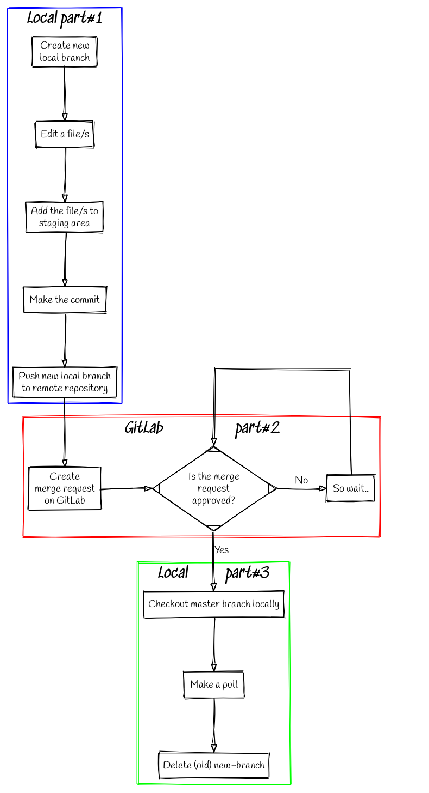
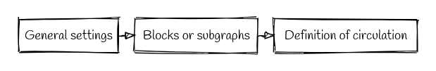
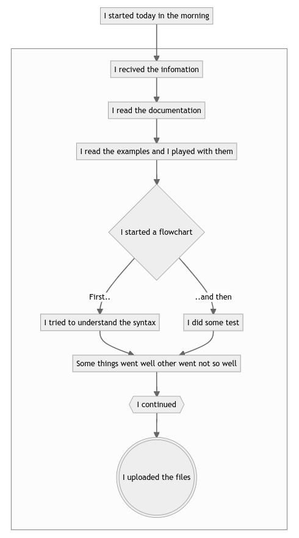

Flowcharts - Graphviz and Mermaid
=================================

Graphviz
--------

This is an example of a flowchart using graphviz


   
   *An example using graphviz - click to see better.*

The corresponding code in *.dot* is,

.. code-block:: console

   ### Normal work in git/gitlab ####

    digraph L {
    # General settings
    node [fontname = "Handlee"];
    splines=false;
    bgcolor=transparent;
    
    # Blocks
    subgraph cluster_local1 {
    label = "*Local part#1*";
    fontsize = 20;
    color=blue
    step1 [ label = "Create new\n local branch", shape=block];
    step2 [ label = "Edit a file/s", shape=block];
    step3 [ label = "Add the file/s to\n staging area", shape=block];
    step4 [ label = "Make the commit", shape=block];
    step5 [ label = "Push new local branch\n to remote repository", shape=block];
    }  
    subgraph cluster_remote {
    label = "*GitLab                   part#2*";
    fontsize = 20;
    color=red
    step6 [ label = "Create\n merge request\n on GitLab", shape=block];
    step7 [ label = "Is the merge\n request\n approved?", shape=Mdiamond];
    step8 [ label = "So wait..", shape=block];
        {
        rank=same;
        step6; step7; step8;
        }
    }
    subgraph cluster_local2 {
    label = "*Local          part#3*";
    fontsize = 20;
    color=green
    step9 [ label = "Checkout master branch locally", shape=block];
    step10 [ label = "Make a pull", shape=block];
    step11 [ label = "Delete (old) new-branch", shape=block];
    }
    
    # Steps
    step1 -> step2 -> step3 -> step4 -> step5;
    step5 -> step6 -> step7; 
    step7 -> step9 [label = "Yes"; fontname = "Handlee"];
    step7 -> step8 [label = "No"; fontname = "Handlee"];
    step9 -> step10 -> step11;
    
    # Something extra to do the loop line in the check box
    {
    rank=same;
    guess2; point2; 
    }
    guess2 [
      label = "              ";
      color= white ;
    ];
    point2 [
      label = "                                       ";
      color=white;
    ];
    step8:n -> point2:n [ arrowhead = none ];
    guess2:n -> point2:n [ arrowhead = none ];
    guess2:n -> step7:n;
 
    }

To understand the code, we can divide it in three sections, and for that is possible to use a graph:


   
   *Chart of a chart*
   
For each instance is possible define format, rank, labes, etc.


Mermaid
-------

Other tool to do flowcharts is Mermaid writing in markdown:


   
   *An example using mermaid.*
   
The corresponding code in *.md* is,

.. code-block:: console

   ## Mixing flowchart + md files

   - How I tried to do a flowchart in Graphviz :sweat: :sweat: :sweat:
   - Testing **mermaid**

   ---

   ```mermaid

    flowchart TB
    AA[I started today in the morning] --> A[I recived the infomation] 
    
    subgraph ide1 [ ]
    A--> B[I read the documentation]
    B --> C[I read the examples and I played with them]
    C --> D{I started a flowchart}
    D -->|First..| E[I tried to understand the syntax]
    D -->|..and then| F[I did some test]
    E --> G[Some things went well other went not so well]
    F --> G[Some things went well other went not so well]
    G --> H{{I continued}}
    H --> I(((I uploaded the files)))

    end
    ```
