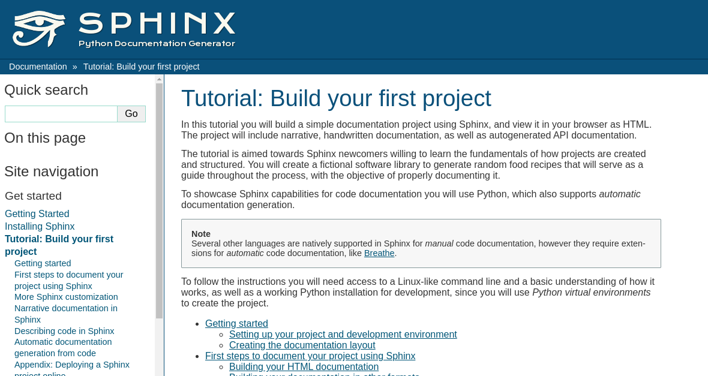

Working with sphinx - Part A
============================

Creation of a sphinx project
----------------------------

Using the `quickstart <https://www.sphinx-doc.org/en/master/usage/quickstart.html>`_ guide is possible create a first project in sphinx just following the instructions.

   
   *Print of the site*

The first steps of the process are:

- Creation of a folder for the project and a file *readme* in .rst.
- Creation of a python virtual environment.
- Installation of tools (sphinx).
- Running of quick configuration.
- Render doc like html.
- Customization.

Some commands
-------------

There are some commands that its necessary use each time, for example: 

- Start sphinx from the terminal

.. code-block:: console

   $ source .venv/bin/activate
   
- Reflect changes

.. code-block:: console

   $ cd docs
   $ make html
  
.. admonition:: Watch out

    This part is very important to see errors.
    

- Check version

.. code-block:: console

   $ sphinx-build --version
