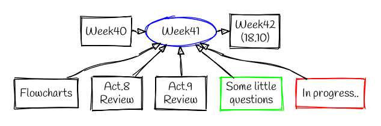

Week 41
=======

Flowcharts
----------

- I worked with graphviz and mermaid in order to create flowcharts, some examples about work daily with git, etc.
- Insertion of a chart of graphviz inside a md file (like at the beginning of this file, if possible click on it and go to its code).

Activity n.8 - Review
---------------------

- Reading of theory of Units testing, mission, its place in the concept of reproducibility, importance like a good practice and a good way to coding, prevention of problems, confidence that the *-update-* works well.
- Tools and programs for test/check.
- Packages for python (unittest, pytest, nose, etc); set of tools for encoding test units.
- Structure of an unit test in python, sintaxis, test case. Reading of demos, examples and videos of U.T. used in python.
- Practice in python; creation of unit tests, working with several files at the same time. Running the test from an IDE and from the terminal.
- CI helps to run tests after push automatically. In  GitLabCI devs can make changes that are automatically tested and pushed out. I inspected the section CI/CD in the repository in gitlab (I think with practice I will understand this..).

Activity n.9 - Review
---------------------

- Introduction to documentation, importance, utility. Ways of documentation, best practices in python. Comments dont replace docu.
- Code format: tools in python. I installed Black and autopep8, I used it in some files from the terminal/ide.
- Markup language, reading about the different standars; principaly about md and rst.
- Executable reports; using of codalb and binder.

Little questions
----------------

- There is a format for python files adopt in idiap? Is embebed automatly in gitlab?
- Whe use .md and .rst? In wich case? We will use .rst?
- The course is write in rest using sphinx? The course itself is an example of reproducibility?
- In the daily work codalab/binder are use?
- There is other option to publidiap.idiap.ch?

In process
----------

- Reading of Activity 10
